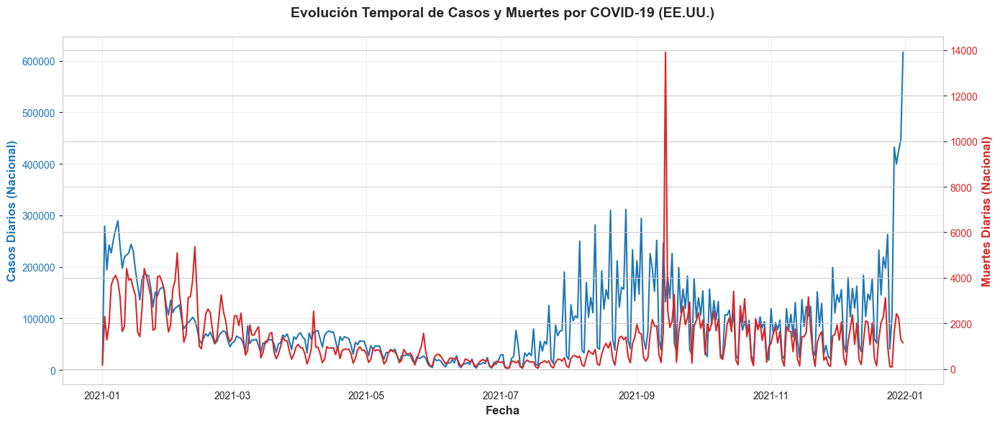
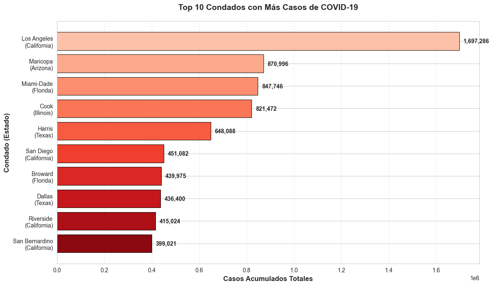
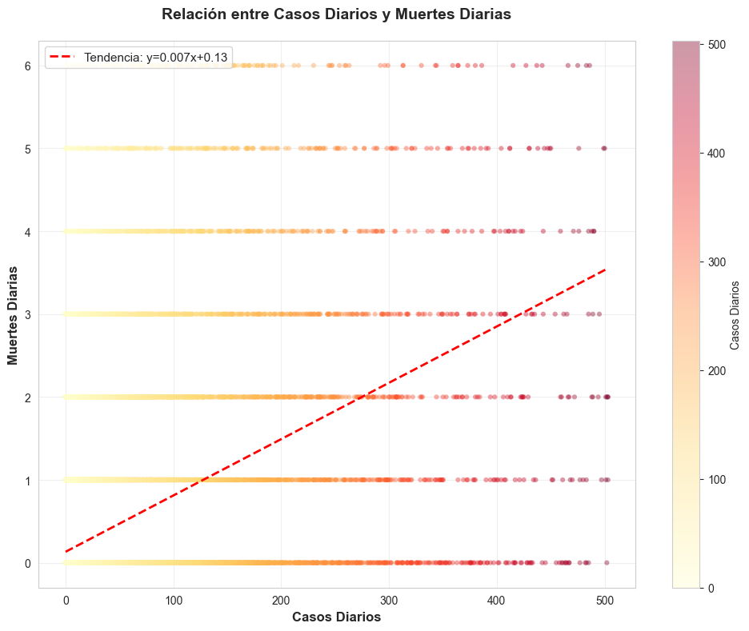
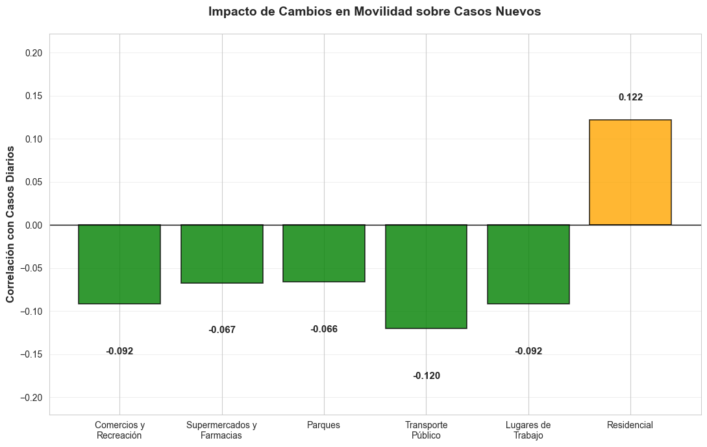
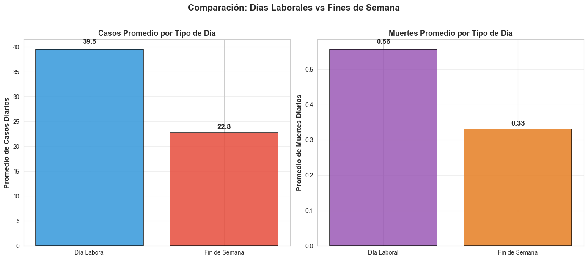
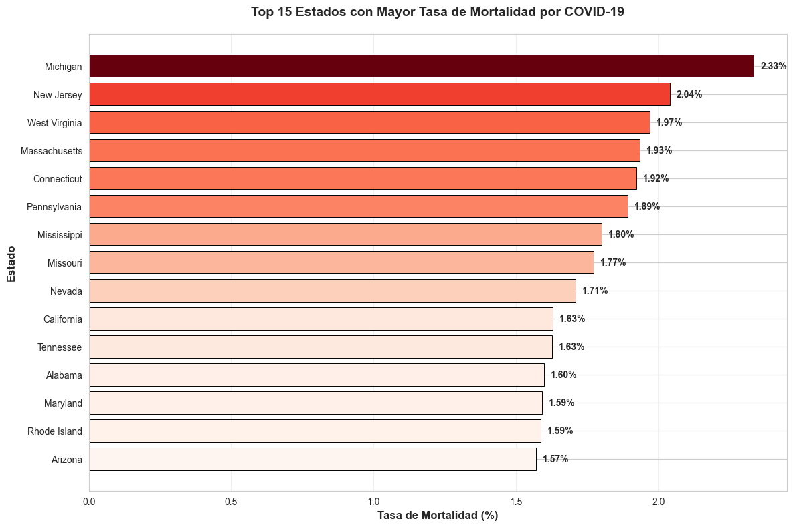
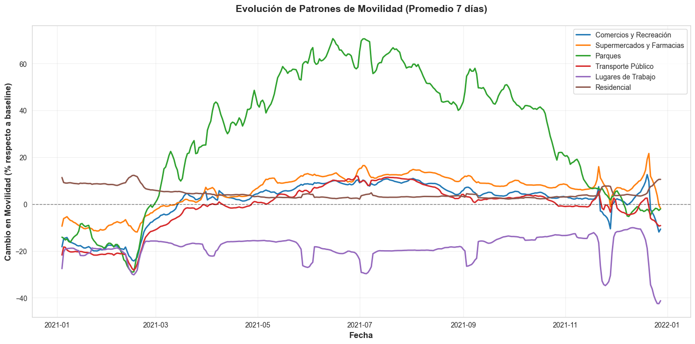
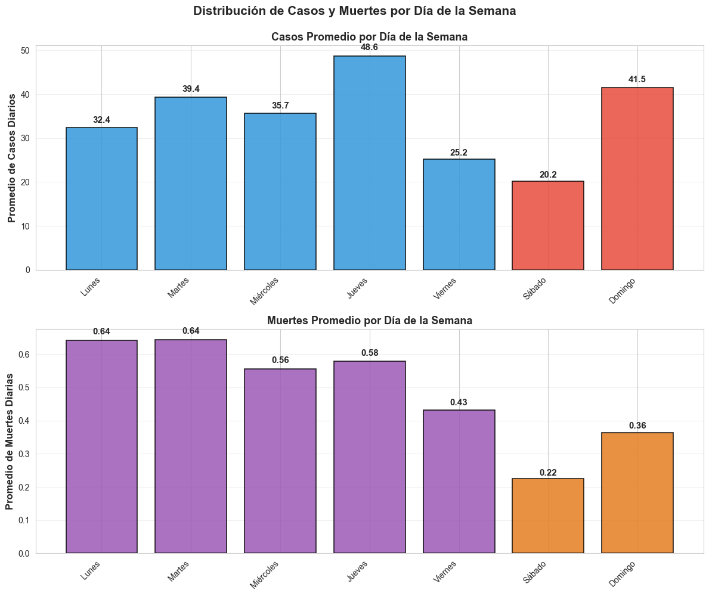
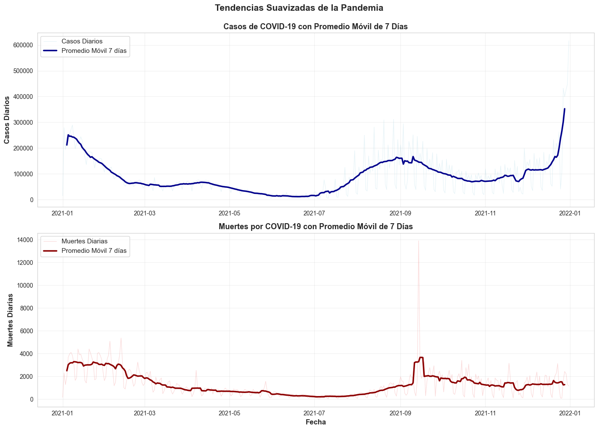
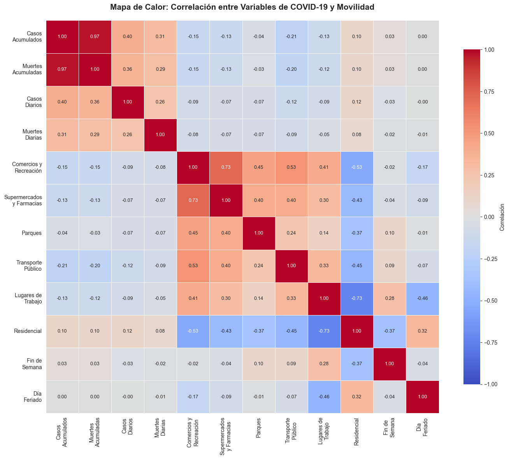

# Análisis de COVID-19 y Movilidad en EE.UU. - Información del Dataset

## 📊 Sobre el Dataset

### Fuente de Datos
Dataset integrado que combina múltiples fuentes de información pública sobre COVID-19 en Estados Unidos durante la pandemia de 2021.

### Contenido del Dataset (`IntegratedData.csv`)

#### 📈 Datos Epidemiológicos
- **Casos confirmados acumulados** por condado y estado
- **Muertes acumuladas** por condado y estado
- **Casos diarios** (nuevos casos reportados cada día)
- **Muertes diarias** (nuevas muertes reportadas cada día)

#### 🗺️ Datos Geográficos
- **Códigos FIPS:** Identificadores únicos de condados
- **Nombres de condados:** ~3,100 condados de EE.UU.
- **Nombres de estados:** 50 estados + territorios

#### 📅 Datos Temporales
- **Fechas completas:** Serie temporal diaria del 2021
- **Día de la semana:** Lunes a Domingo
- **Indicadores:** Fines de semana, días feriados
- **Estacionalidad:** Patrones por mes, trimestre

#### 🚶 Datos de Movilidad
Cambios porcentuales respecto a una línea base pre-pandemia en visitas a:
- **Comercios y recreación:** Tiendas, restaurantes, centros comerciales, cines
- **Supermercados y farmacias:** Tiendas de alimentos, farmacias
- **Parques:** Parques nacionales, playas, plazas públicas
- **Estaciones de transporte:** Metro, autobuses, trenes
- **Lugares de trabajo:** Oficinas, fábricas
- **Zonas residenciales:** Tiempo pasado en casa

### Especificaciones Técnicas

- **Período:** 2021 (año completo)
- **Alcance Geográfico:** Nacional (Estados Unidos)
- **Granularidad:** Nivel de condado (más detallado que estado)
- **Tamaño del archivo:** ~77 MB
- **Número de registros:** Más de 935,000 filas
- **Frecuencia temporal:** Datos diarios
- **Cobertura:** ~3,100 condados en 50 estados

---

## 🎯 ¿Para Qué Sirve Este Dataset?

### 1. 🏥 Análisis Epidemiológico

**Aplicaciones:**
- Identificar patrones temporales de la pandemia (olas, picos estacionales)
- Comparar severidad de la pandemia entre diferentes regiones
- Analizar tasas de mortalidad por área geográfica
- Estudiar la velocidad de propagación del virus
- Evaluar el impacto de variantes del virus

**¿Quién lo usa?**
- Epidemiólogos
- Investigadores de salud pública
- Hospitales y sistemas de salud
- Organizaciones sanitarias internacionales (CDC, OMS)

**Ejemplo práctico:**
Un hospital puede usar las gráficas de evolución temporal para anticipar picos de hospitalizaciones 2-3 semanas después de ver aumentos en casos diarios.

---

### 2. 🏛️ Políticas de Salud Pública

**Aplicaciones:**
- Evaluar efectividad de medidas de confinamiento
- Identificar áreas que requieren más recursos sanitarios
- Planificar estrategias de respuesta a futuras pandemias
- Diseñar campañas de vacunación dirigidas
- Optimizar asignación de recursos (ventiladores, personal médico)

**¿Quién lo usa?**
- Gobiernos estatales y locales
- Departamentos de salud pública
- Planificadores de políticas públicas
- Gestores de emergencias

**Ejemplo práctico:**
Un gobierno local puede usar las correlaciones entre movilidad y casos para diseñar restricciones específicas (ej: limitar transporte público pero permitir parques).

---

### 3. 🚶 Estudios de Comportamiento Social

**Aplicaciones:**
- Entender cómo cambiaron los patrones de movilidad durante la pandemia
- Analizar correlación entre movilidad y contagios
- Estudiar diferencias de comportamiento entre días laborales y fines de semana
- Medir el cumplimiento de restricciones de movilidad
- Identificar factores sociodemográficos que influyen en el comportamiento

**¿Quién lo usa?**
- Sociólogos
- Psicólogos sociales
- Investigadores de comportamiento humano
- Urbanistas y planificadores urbanos

**Ejemplo práctico:**
Investigadores pueden estudiar si el trabajo remoto (observado en datos de movilidad laboral) tuvo impacto real en la reducción de casos.

---

### 4. 🎓 Investigación Académica

**Aplicaciones:**
- Desarrollar modelos predictivos de propagación viral
- Estudios de correlación entre variables socioeconómicas y salud
- Análisis de series temporales y forecasting
- Machine learning para predicción de brotes
- Análisis geoespacial de propagación de enfermedades

**¿Quién lo usa?**
- Profesores y estudiantes universitarios
- Investigadores en ciencia de datos
- Estudiantes de maestría y doctorado
- Centros de investigación

**Ejemplo práctico:**
Un estudiante de maestría puede usar este dataset para entrenar un modelo que prediga casos futuros basándose en patrones de movilidad actuales.

---

### 5. 💼 Toma de Decisiones Empresariales

**Aplicaciones:**
- **Empresas:** Planificación de operaciones durante crisis sanitarias
- **Retail:** Ajustar horarios y personal según patrones de movilidad
- **Transporte:** Planificar servicios según demanda real
- **Seguros:** Evaluar riesgos y ajustar primas
- **Inmobiliaria:** Entender cambios en preferencias de ubicación
- **Tecnología:** Desarrollar soluciones de monitoreo y predicción

**¿Quién lo usa?**
- Directores ejecutivos (CEOs)
- Gerentes de operaciones
- Analistas de negocios
- Consultores estratégicos

**Ejemplo práctico:**
Una cadena de supermercados puede usar los datos de movilidad para decidir cuántas tiendas mantener abiertas y en qué horarios durante picos de pandemia.

---

### 6. 🗣️ Comunicación y Periodismo

**Aplicaciones:**
- Crear visualizaciones comprensibles para el público
- Reportar tendencias basadas en datos reales
- Combatir desinformación con evidencia
- Explicar conceptos epidemiológicos complejos

**¿Quién lo usa?**
- Periodistas de datos
- Comunicadores científicos
- Diseñadores de información
- Equipos de comunicación pública

**Ejemplo práctico:**
Un periodista puede usar las gráficas de promedio móvil para explicar por qué los reportes diarios tienen fluctuaciones y por qué las tendencias de 7 días son más confiables.

---

## 📊 Visualizaciones del Dataset (11 Gráficas Profesionales)

Este proyecto genera automáticamente 11 visualizaciones en español que ayudan a interpretar los datos. Todas se guardan en alta resolución (300 DPI) en `Output/figures/`.

---

### 1️⃣ Evolución Temporal de Casos y Muertes (Nacional)
**Archivo:** `1_evolucion_casos_muertes.png`



**¿Qué muestra?**
Gráfica de líneas doble con dos ejes Y que muestra la suma nacional diaria de casos (azul) y muertes (rojo) a lo largo del tiempo.

**¿Cómo interpretarla?**
- **Picos azules (casos):** Indican olas de contagios
- **Picos rojos (muertes):** Siguen a los picos de casos con 2-3 semanas de retraso
- **Altura de picos:** Muestra la severidad de cada ola
- **Distancia entre olas:** Indica períodos de recuperación

**¿Qué nos dice?**
Esta visualización es fundamental para entender la cronología de la pandemia:
- Los picos de casos anticipan picos de muertes (útil para predicción)
- Permite identificar cuándo comienza y termina cada ola
- Muestra si las medidas de salud pública están funcionando (picos más bajos)

**Utilidad práctica:**
- **Hospitales:** Prepararse para picos de muertes 2-3 semanas después de ver picos de casos
- **Gobiernos:** Decidir cuándo implementar restricciones (ola creciente) o levantarlas (ola descendente)
- **Público general:** Evaluar riesgo personal según la tendencia actual

---

### 2️⃣ Top 10 Condados con Más Casos Acumulados
**Archivo:** `2_top_condados_casos.png`



**¿Qué muestra?**
Gráfica de barras horizontales ordenada mostrando los 10 condados con mayor número de casos totales, incluyendo el nombre del estado entre paréntesis.

**¿Cómo interpretarla?**
- **Barra más larga:** Condado con más casos acumulados
- **Comparación visual:** Muestra la diferencia relativa entre condados
- **Nombres:** Formato "Condado (Estado)" para identificación clara

**¿Qué nos dice?**
Muestra las "zonas calientes" de la pandemia:
- Típicamente son áreas metropolitanas grandes (Los Angeles, Nueva York, Chicago)
- Reflejan densidad poblacional y conectividad (aeropuertos, comercio)
- Indican dónde se concentró el mayor impacto de la pandemia

**Utilidad práctica:**
- **Gobiernos:** Dirigir vacunas y recursos médicos a estas áreas prioritarias
- **Empresas:** Ajustar operaciones según nivel de riesgo por zona
- **Investigadores:** Estudiar qué factores tienen en común las áreas más afectadas
- **Planificación:** Priorizar mejoras en infraestructura de salud

---

### 3️⃣ Relación entre Casos Diarios y Muertes Diarias
**Archivo:** `3_casos_vs_muertes.png`



**¿Qué muestra?**
Diagrama de dispersión (scatter plot) con línea de tendencia roja mostrando la correlación entre casos diarios (eje X) y muertes diarias (eje Y).

**¿Cómo interpretarla?**
- **Cada punto:** Representa un día específico
- **Línea roja:** Muestra la tendencia general (letalidad promedio)
- **Pendiente empinada:** Alta letalidad
- **Puntos dispersos:** Variabilidad por múltiples factores

**¿Qué nos dice?**
La pendiente de la línea muestra la "letalidad promedio" del virus:
- **Alta pendiente:** Más muertes por cada caso (peor escenario)
- **Baja pendiente:** Menos muertes por caso (tratamientos mejorando)
- **Dispersión:** Indica que hay muchos factores adicionales:
  - Calidad del sistema de salud local
  - Demografía (población mayor = más muertes)
  - Acceso a tratamientos y vacunas
  - Variantes del virus circulantes

**Utilidad práctica:**
- **Comparar períodos:** Si la pendiente disminuye con el tiempo, indica mejora en tratamientos
- **Evaluar efectividad:** Medir si nuevos tratamientos reducen la letalidad
- **Identificar outliers:** Días con muertes inusualmente altas requieren investigación
- **Predicción:** Estimar muertes futuras basándose en casos actuales

---

### 4️⃣ Impacto de Cambios en Movilidad sobre Casos Nuevos
**Archivo:** `4_movilidad_correlacion.png`



**¿Qué muestra?**
Gráfica de barras mostrando las correlaciones entre diferentes tipos de movilidad y casos diarios, con colores indicando el tipo de correlación.

**¿Cómo interpretarla?**
- **Barras verdes (negativas):** Menos actividad = menos casos (ej: quedarse en casa)
- **Barras naranjas/rojas (positivas):** Más actividad = más casos (ej: transporte público)
- **Altura de barra:** Fuerza de la correlación

**¿Qué nos dice?**
Esta es UNA DE LAS GRÁFICAS MÁS IMPORTANTES para políticas públicas:

**Correlaciones negativas (buenas):**
- **Movilidad residencial:** Más tiempo en casa → menos casos ✓

**Correlaciones positivas (esperadas):**
- **Transporte público:** Alta correlación (cercanía física prolongada)
- **Comercios:** Más visitas a tiendas → más casos
- **Lugares de trabajo:** Oficinas cerradas → más trabajo remoto → menos casos

**Utilidad práctica:**
- **Diseñar restricciones efectivas:** Enfocarse en reducir actividades con mayor correlación positiva
- **Evaluar políticas:** ¿Funcionó el cierre de comercios? Ver si la movilidad realmente bajó
- **Educación pública:** Comunicar qué actividades son más riesgosas
- **Empresas:** Decidir políticas de trabajo remoto basadas en datos reales
- **Priorizar medidas:** Si recursos son limitados, restringir primero transporte público

---

### 5️⃣ Comparación: Días Laborales vs Fines de Semana
**Archivo:** `5_comparacion_dias.png`



**¿Qué muestra?**
Dos gráficas de barras lado a lado comparando promedios de casos (izquierda) y muertes (derecha) en días laborales versus fines de semana.

**¿Cómo interpretarla?**
- **Barras azules/moradas:** Días laborales (L-V)
- **Barras rojas/naranjas:** Fines de semana (S-D)
- **Altura relativa:** Muestra diferencias en reportes

**¿Qué nos dice?**
Revela un SESGO IMPORTANTE en los datos:

**Típicamente se observa:**
- **Fines de semana:** Menos casos reportados (pero NO necesariamente menos contagios reales)
- **Días laborales:** Más casos reportados (especialmente lunes)

**¿Por qué ocurre esto?**
- **Efecto administrativo:** Menos personal de laboratorio trabajando en fines de semana
- **Retraso de reportes:** Casos del fin de semana se acumulan y reportan el lunes/martes
- **Comportamiento:** Menos gente va al médico en fin de semana

**Utilidad práctica:**
- **Modelos predictivos:** Deben incluir variables de día de la semana para ajustar
- **Comunicación pública:** No alarmar por "bajadas" los domingos ni por "subidas" los lunes
- **Análisis correcto:** Usar promedios de 7 días en lugar de datos diarios crudos
- **Planificación hospitalaria:** Anticipar más diagnósticos acumulados los lunes

---

### 6️⃣ Top 10 Estados Más Afectados
**Archivo:** `6_top_estados_casos.png`


**¿Qué muestra?**
Gráfica de barras horizontales mostrando los 10 estados con mayor número de casos totales acumulados.

**¿Cómo interpretarla?**
- **Orden:** De mayor a menor casos acumulados
- **Longitud de barras:** Proporcional al número de casos
- **Comparación:** Muestra diferencias relativas entre estados

**¿Qué nos dice?**
Análisis a nivel estatal de la pandemia:

**Factores que explican las diferencias:**
- **Población:** California, Texas, Florida tienen más casos por ser más poblados
- **Densidad urbana:** Estados con grandes metrópolis tienen más transmisión
- **Conectividad:** Estados con aeropuertos principales recibieron casos más temprano
- **Políticas locales:** Restricciones más o menos estrictas afectan los números

**Utilidad práctica:**
- **Comparar políticas:** Estudiar qué hicieron diferente estados con menos casos
- **Asignación federal:** Distribuir recursos proporcionalmente a impacto
- **Estudios de caso:** ¿Por qué algunos estados lo hicieron mejor?
- **Planificación futura:** Aprender de experiencias estatales para próximas pandemias

---

### 7️⃣ Tasa de Mortalidad por Estado
**Archivo:** `7_tasa_mortalidad_estados.png`



**¿Qué muestra?**
Top 15 estados con mayor porcentaje de muertes respecto a casos (tasa de letalidad), con barras coloreadas por intensidad.

**¿Cómo interpretarla?**
- **Porcentaje:** (Muertes / Casos) × 100
- **Rojo más intenso:** Mayor tasa de mortalidad
- **No es cantidad absoluta:** Es severidad relativa

**¿Qué nos dice?**
Esta gráfica es MÁS IMPORTANTE que el número absoluto de casos porque muestra la **severidad relativa**:

**Un estado puede tener pocos casos pero alta mortalidad, indicando:**
- **Sistema de salud saturado:** Hospitales sin capacidad para atender a todos
- **Población vulnerable:** Mayor proporción de personas mayores o con comorbilidades
- **Acceso limitado:** Menos acceso a antivirales, oxígeno, UCI
- **Variantes más letales:** Algunas variantes del virus son más mortales
- **Diagnóstico tardío:** Casos detectados cuando ya están en estado grave

**Utilidad práctica:**
- **Priorizar recursos:** Mejorar infraestructura de salud en estados con alta letalidad
- **Aprender mejores prácticas:** Investigar qué hacen bien los estados con baja letalidad
- **Dirigir tratamientos:** Enviar equipos médicos y medicamentos a estados críticos
- **Análisis económico:** Medir impacto en productividad y costos sanitarios por estado

---

### 8️⃣ Evolución de Movilidad en el Tiempo
**Archivo:** `8_evolucion_movilidad.png`



**¿Qué muestra?**
Series temporales múltiples mostrando cambios porcentuales en movilidad para 6 categorías diferentes, suavizadas con promedio de 7 días.

**¿Cómo interpretarla?**
- **Línea 0%:** Nivel pre-pandemia (línea base)
- **Por arriba de 0%:** Más actividad que antes de la pandemia
- **Por debajo de 0%:** Menos actividad que antes de la pandemia
- **Colores:** Cada categoría de movilidad tiene su color distintivo

**¿Qué nos dice?**
Esta es una "RADIOGRAFÍA DEL COMPORTAMIENTO SOCIAL" durante la pandemia:

**Fase 1 - Confinamiento (inicio):**
- Todas las líneas caen bruscamente excepto residencial
- La gente se queda en casa (residencial sube)
- Comercios, trabajo, transporte caen 50-80%

**Fase 2 - Reapertura gradual:**
- Las líneas empiezan a subir progresivamente
- Supermercados suben primero (esenciales)
- Parques tienen alta variabilidad (clima)

**Fase 3 - Nueva normalidad:**
- Patrones se estabilizan pero NO vuelven al 100%
- Trabajo nunca recupera niveles pre-pandemia (trabajo remoto permanente)
- Transporte público tiene recuperación muy lenta (miedo al contagio)

**Utilidad práctica:**
- **Transporte:** Planificar servicios según demanda real observada
- **Comercios:** Ajustar horarios y número de empleados según patrones
- **Gobiernos:** Evaluar cumplimiento de restricciones (¿la gente realmente se quedó en casa?)
- **Economistas:** Medir impacto en sectores específicos (turismo, retail, transporte)
- **Urbanistas:** Diseñar ciudades más resilientes para futuras crisis

---

### 9️⃣ Distribución por Día de la Semana
**Archivo:** `9_casos_dia_semana.png`



**¿Qué muestra?**
Dos gráficas de barras mostrando promedio de casos (izquierda) y muertes (derecha) para cada día de la semana (Lunes a Domingo).

**¿Cómo interpretarla?**
- **Días laborales:** Colores azul/morado (L-V)
- **Fines de semana:** Colores rojo/naranja (S-D)
- **Altura:** Promedio de casos/muertes para ese día en todo el año

**¿Qué nos dice?**
Patrón semanal detallado de reportes:

**Observaciones típicas:**
- **Domingo:** MÍNIMO (menos reportes administrativos)
- **Lunes/Martes:** PICOS artificiales (se reportan casos acumulados del fin de semana)
- **Miércoles-Viernes:** Datos más estables y confiables
- **Sábado:** Comienza a bajar

**Diferencia entre casos y muertes:**
- **Casos:** Mayor variabilidad semanal (más dependiente de reportes administrativos)
- **Muertes:** Menos variabilidad (eventos críticos se reportan más consistentemente)

**Utilidad práctica:**
- **Para analistas:** No comparar lunes con domingo directamente
- **Para modelos:** Incluir variables dummy de día de la semana
- **Para medios:** Reportar promedios de 7 días, no fluctuaciones diarias
- **Para hospitales:** Anticipar más diagnósticos oficiales los lunes (no más casos reales)

---

### 🔟 Promedio Móvil de Casos (7 días)
**Archivo:** `10_promedio_movil.png`



**¿Qué muestra?**
Dos gráficas con datos diarios crudos (línea tenue con transparencia) y promedio móvil de 7 días (línea gruesa y sólida) para casos (arriba) y muertes (abajo).

**¿Cómo interpretarla?**
- **Línea tenue:** Datos diarios reales (con todo el ruido)
- **Línea gruesa:** Promedio de los últimos 7 días (tendencia suave)
- **Cuando la gruesa sube:** Pandemia empeorando
- **Cuando la gruesa baja:** Pandemia mejorando

**¿Qué nos dice?**
Esta es la versión "LIMPIA" de los datos. El promedio móvil de 7 días elimina:

- **Ruido de fin de semana:** Ya no vemos bajadas artificiales los domingos
- **Picos administrativos:** Los lunes ya no se ven inflados
- **Fluctuaciones aleatorias:** Eventos únicos no distorsionan la tendencia

**¿Por qué 7 días?**
- Captura un ciclo semanal completo
- Es el estándar usado por CDC, OMS y medios internacionales
- Permite comparaciones entre países

**Cómo leerla:**
- **Línea sube:** Pandemia empeorando (ola creciente) 📈
- **Línea baja:** Pandemia mejorando (ola descendente) 📉
- **Línea plana:** Situación estable (meseta)
- **Cambio de pendiente:** Momento crucial para decisiones de política

**Utilidad práctica:**
- **Gobiernos:** Decidir cuándo implementar o levantar restricciones
- **Hospitales:** Planificar capacidad con 1-2 semanas de anticipación
- **Medios:** Reportar tendencias reales sin alarmar por fluctuaciones diarias
- **Individuos:** Evaluar riesgo personal según dirección de la tendencia

---

### 1️⃣1️⃣ Mapa de Calor de Correlación Completo
**Archivo:** `11_mapa_calor_correlacion.png`



**¿Qué muestra?**
Matriz de correlación (heatmap) entre TODAS las variables numéricas del dataset: casos, muertes, movilidad, indicadores temporales.

**¿Cómo interpretarla?**
- **Rojo intenso:** Correlación positiva fuerte (+1.0) → cuando una sube, la otra también
- **Azul intenso:** Correlación negativa fuerte (-1.0) → cuando una sube, la otra baja
- **Blanco/neutro:** Sin correlación (0) → variables independientes
- **Diagonal:** Siempre 1.0 (cada variable correlaciona perfectamente consigo misma)
- **Números:** Coeficiente de correlación de Pearson (-1 a +1)

**¿Qué nos dice?**
Este es el "MAPA DE CONEXIONES" entre todas las variables:

**Correlaciones esperadas (validan calidad de datos):**
- **Casos acumulados ↔ Muertes acumuladas (~0.95):** Muy alta → más casos = más muertes ✓
- **Daily_cases ↔ Daily_deaths:** Moderada → relación causa-efecto con retraso

**Correlaciones interesantes (insights):**
- **Movilidad residencial ↔ Otros tipos de movilidad:** Negativa → quedarse en casa ↔ salir menos
- **Daily_cases ↔ Movilidad en comercios:** Positiva → más visitas = más contagios
- **Daily_cases ↔ Movilidad residencial:** Negativa → quedarse en casa = menos casos

**Correlaciones para investigar:**
- **Is_weekend ↔ Daily_cases:** Si es negativa, confirma sesgo de reporte
- **Is_holiday ↔ Daily_cases:** Similar al fin de semana
- **Movilidad trabajo ↔ Daily_cases:** Mide impacto del trabajo remoto

**Utilidad práctica:**
- **Científicos de datos:** Seleccionar variables para modelos predictivos (evitar multicolinealidad)
- **Epidemiólogos:** Identificar factores de riesgo principales para intervención
- **Políticos:** Decidir qué restricciones implementar (enfocarse en alta correlación)
- **Investigadores:** Generar hipótesis nuevas basadas en correlaciones inesperadas
- **Verificación de calidad:** Detectar datos anómalos (correlaciones imposibles)

---

## 🔍 Insights Principales del Análisis

Después de procesar y visualizar este dataset, podemos concluir:

### 1. ✅ La movilidad SÍ afecta los contagios
- Correlación clara entre actividades públicas y casos
- Transporte público muestra la correlación más fuerte
- Quedarse en casa correlaciona negativamente con casos

### 2. ✅ Las muertes siguen a los casos con 2-3 semanas de retraso
- Patrón consistente y predecible
- Permite a hospitales prepararse con anticipación
- Crucial para planificación de recursos médicos

### 3. ✅ Los datos tienen sesgo de reporte
- Fines de semana muestran menos casos (efecto administrativo)
- Lunes tienen picos artificiales (acumulación)
- Esencial usar promedios móviles de 7 días

### 4. ✅ La tasa de mortalidad varía por región
- No todos los estados experimentaron la misma severidad
- Factores: demografía, sistema de salud, acceso a tratamientos
- Importante para asignación equitativa de recursos

### 5. ✅ El comportamiento social cambió drásticamente
- Gráficas de movilidad muestran "antes y después" claro
- Trabajo remoto se adoptó masivamente
- Transporte público nunca recuperó niveles pre-pandemia

### 6. ✅ Los promedios móviles son esenciales
- Datos diarios crudos tienen demasiado ruido
- Ventanas de 7 días capturan ciclos semanales
- Facilitan identificación de tendencias reales

---

## 💡 Recomendaciones para Interpretar los Datos

### 1. Siempre usa promedios móviles
- Los datos diarios tienen mucho ruido administrativo
- Ventana de 7 días es el estándar internacional
- Facilita ver tendencias reales vs. fluctuaciones

### 2. Ten en cuenta el sesgo de reporte
- Fines de semana: menos reportes
- Lunes: picos artificiales
- Compara semanas completas, no días individuales

### 3. Contexto es clave
- Considera población de cada región
- Tasas per cápita > números absolutos
- Factores locales afectan resultados

### 4. Correlación ≠ Causalidad
- Movilidad correlaciona con casos, pero hay otros factores
- Usa análisis multivariable para conclusiones robustas
- Considera variables confusoras (clima, política, economía)

### 5. Valida tus hipótesis
- Usa múltiples gráficas para confirmar patrones
- Compara diferentes períodos temporales
- Busca consistencia en distintos niveles geográficos

---

## 📖 Documentación Relacionada

- 📖 **[README.md](README.md)** - Documentación técnica del código, explicación de módulos, guía para desarrolladores

---

## 📊 Cómo Generar las Visualizaciones

### Opción 1: Pipeline completo
```bash
python pipeline.py
```
Genera todas las 11 gráficas automáticamente en `Output/figures/`

### Opción 2: Solo visualizaciones
```bash
python -m Vizualize.plot --input "Output/IntegratedData_cleaned.csv" --outdir "Output/figures"
```

### Opción 3: Desde código Python
```python
from Vizualize.plot import generar_todas_las_graficas

generar_todas_las_graficas(
    csv_path="Output/IntegratedData_transformed.csv",
    output_dir="Output/figures"
)
```

---

## 📞 Contacto y Recursos

- **Repositorio:** https://github.com/kenmaroyert1/WilsonTrabajo1
- **Documentación Técnica:** [README.md](README.md)
- **Proyecto académico** - Universidad

---

**Última actualización:** Febrero 2026
